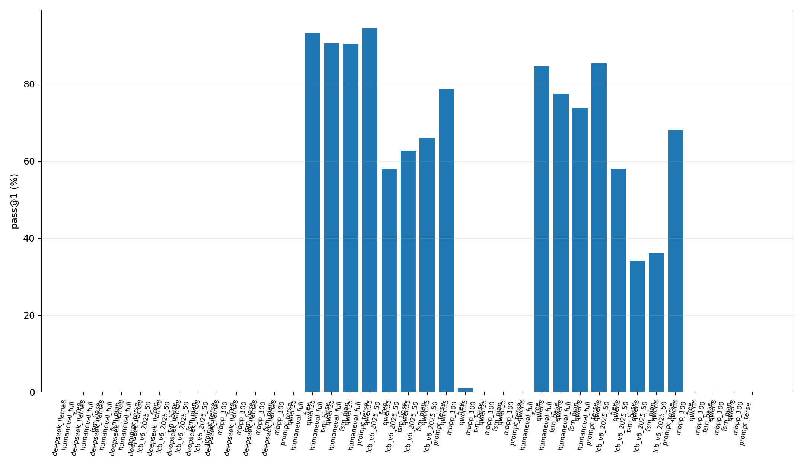
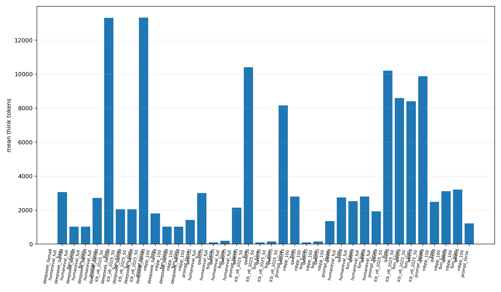
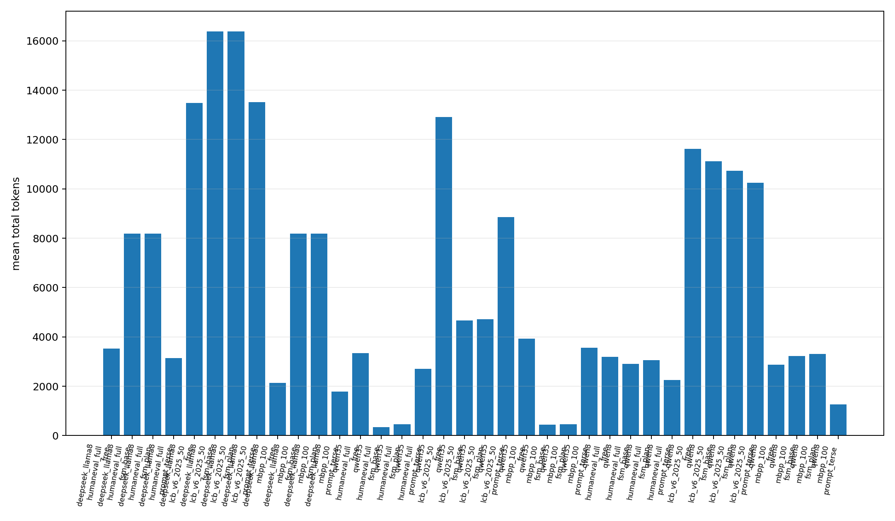
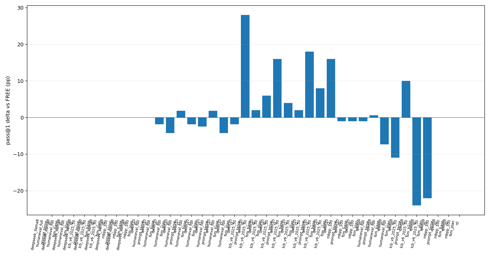
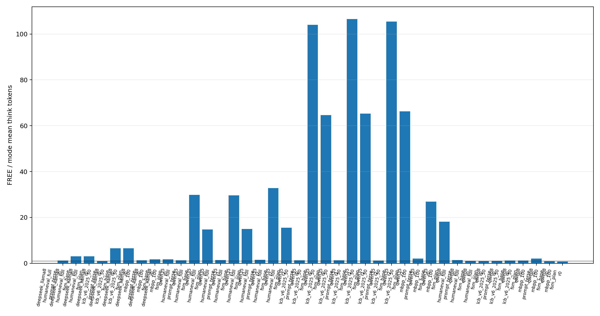
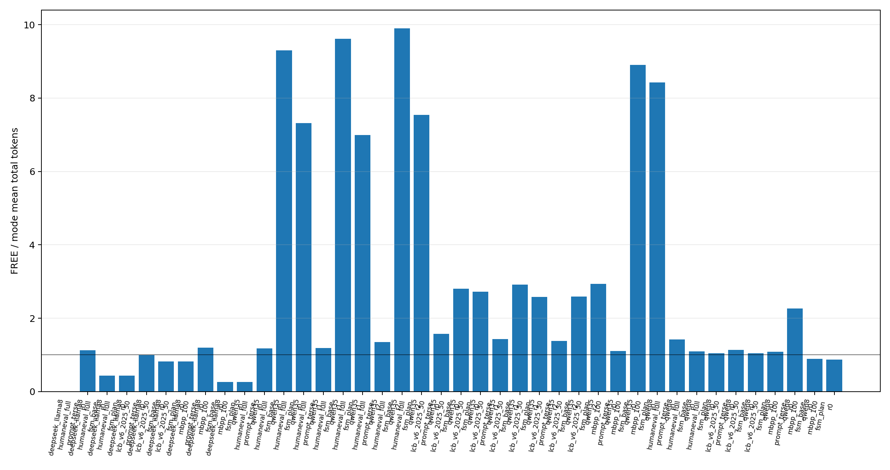

# vLLM Structured-CoT Matrix Findings

## Scope

This report summarizes the vLLM-only matrix artifacts under `experiments/vllm_matrix_20260426`.

Runtime configuration is not swept as an experimental factor: there is no quantization, no alternate serving stack, and no reasoning parser. Serving uses fixed vLLM settings for the run: Qwen3.6-35B-A3B was served TP=4, and the 8B models were served as DP=4/TP=1 replicas with `max_model_len=32768`, `max_num_seqs=128`, and `max_num_batched_tokens=65536`.

## Skipped Cells

- `experiments/vllm_matrix_20260426/runs/qwen35/lcb_v6_post_20260423_50/SKIPPED.json`: no problems after filtering (count=0)
- `experiments/vllm_matrix_20260426/runs/deepseek_llama8/lcb_v6_post_20260423_50/SKIPPED.json`: no problems after filtering (count=0)
- `experiments/vllm_matrix_20260426/runs/qwen8/lcb_v6_post_20260423_50/SKIPPED.json`: no problems after filtering (count=0)

## Interpretation Guardrails

- Treat this as a vLLM replication/generalization study, not a bit-for-bit reproduction of the original llama.cpp/GGUF run.
- The headline reproduction claim should be scoped to Qwen3.6-35B-A3B under vLLM: large explicit-think compression is reproduced, while HumanEval pass-rate parity is not exactly reproduced in this run.
- LiveCodeBench results are public functional-test results from `livecodebench/code_generation_lite`, not official hidden-test leaderboard scores.
- MBPP rows are diagnostic only: the current MBPP harness frequently falls back to `candidate` while tests expect task-specific entry points, so MBPP pass rates should not be used as model-capability claims.
- DeepSeek-R1-Distill-Llama-8B rows are diagnostic generalization evidence only unless separately fixed: completed cells show output-format/harness mismatch, and constrained cells emitted repeated vLLM/xgrammar FSM-advance warnings in the server log.
- Pooled averages below mix headline and exploratory cells; use per-model/per-benchmark rows for claims.

## Charts

## Cell Summary

| Model | Benchmark | Mode | Repeats | pass@1 mean | pass@1 sd | Think mean | Total mean | Post-think mean |
| --- | --- | --- | ---: | ---: | ---: | ---: | ---: | ---: |
| deepseek_llama8 | humaneval_full | free | 1 | 0.0 | - | 3062 | 3520 | 458 |
| deepseek_llama8 | humaneval_full | fsm_base | 1 | 0.0 | - | 1026 | 8192 | 7166 |
| deepseek_llama8 | humaneval_full | fsm_plan | 1 | 0.0 | - | 1026 | 8192 | 7166 |
| deepseek_llama8 | humaneval_full | prompt_terse | 1 | 0.0 | - | 2724 | 3134 | 410 |
| deepseek_llama8 | lcb_v6_2025_50 | free | 1 | 0.0 | - | 13311 | 13480 | 168 |
| deepseek_llama8 | lcb_v6_2025_50 | fsm_base | 1 | 0.0 | - | 2050 | 16384 | 14334 |
| deepseek_llama8 | lcb_v6_2025_50 | fsm_plan | 1 | 0.0 | - | 2050 | 16384 | 14334 |
| deepseek_llama8 | lcb_v6_2025_50 | prompt_terse | 1 | 0.0 | - | 13326 | 13518 | 194 |
| deepseek_llama8 | mbpp_100 | free | 1 | 0.0 | - | 1801 | 2131 | 330 |
| deepseek_llama8 | mbpp_100 | fsm_base | 1 | 0.0 | - | 1026 | 8192 | 7166 |
| deepseek_llama8 | mbpp_100 | fsm_plan | 1 | 0.0 | - | 1026 | 8192 | 7166 |
| deepseek_llama8 | mbpp_100 | prompt_terse | 1 | 0.0 | - | 1425 | 1775 | 349 |
| qwen35 | humaneval_full | free | 3 | 93.3 | 0.6 | 2999 | 3340 | 341 |
| qwen35 | humaneval_full | fsm_base | 3 | 90.7 | 1.5 | 98 | 348 | 250 |
| qwen35 | humaneval_full | fsm_plan | 3 | 90.4 | 1.8 | 199 | 459 | 260 |
| qwen35 | humaneval_full | prompt_terse | 3 | 94.5 | 1.6 | 2147 | 2710 | 563 |
| qwen35 | lcb_v6_2025_50 | free | 3 | 58.0 | 5.3 | 10403 | 12908 | 2505 |
| qwen35 | lcb_v6_2025_50 | fsm_base | 3 | 62.7 | 5.0 | 99 | 4669 | 4570 |
| qwen35 | lcb_v6_2025_50 | fsm_plan | 3 | 66.0 | 4.0 | 159 | 4711 | 4552 |
| qwen35 | lcb_v6_2025_50 | prompt_terse | 3 | 78.7 | 6.1 | 8164 | 8853 | 688 |
| qwen35 | mbpp_100 | free | 1 | 1.0 | - | 2806 | 3924 | 1118 |
| qwen35 | mbpp_100 | fsm_base | 1 | 0.0 | - | 104 | 441 | 337 |
| qwen35 | mbpp_100 | fsm_plan | 1 | 0.0 | - | 155 | 465 | 311 |
| qwen35 | mbpp_100 | prompt_terse | 1 | 0.0 | - | 1360 | 3552 | 2192 |
| qwen8 | humaneval_full | free | 1 | 84.8 | - | 2746 | 3192 | 445 |
| qwen8 | humaneval_full | fsm_base | 1 | 77.4 | - | 2522 | 2908 | 387 |
| qwen8 | humaneval_full | fsm_plan | 1 | 73.8 | - | 2794 | 3052 | 259 |
| qwen8 | humaneval_full | prompt_terse | 1 | 85.4 | - | 1923 | 2252 | 328 |
| qwen8 | lcb_v6_2025_50 | free | 1 | 58.0 | - | 10197 | 11620 | 1423 |
| qwen8 | lcb_v6_2025_50 | fsm_base | 1 | 34.0 | - | 8592 | 11121 | 2529 |
| qwen8 | lcb_v6_2025_50 | fsm_plan | 1 | 36.0 | - | 8398 | 10736 | 2339 |
| qwen8 | lcb_v6_2025_50 | prompt_terse | 1 | 68.0 | - | 9875 | 10240 | 364 |
| qwen8 | mbpp_100 | free | 1 | 0.0 | - | 2483 | 2878 | 394 |
| qwen8 | mbpp_100 | fsm_base | 1 | 0.0 | - | 3119 | 3230 | 110 |
| qwen8 | mbpp_100 | fsm_plan | 1 | 0.0 | - | 3203 | 3304 | 101 |
| qwen8 | mbpp_100 | prompt_terse | 1 | 0.0 | - | 1221 | 1270 | 49 |

## Paired Deltas vs FREE

| Model | Benchmark | Mode | Repeats | pass delta pp mean | pass delta pp sd | Think compression | Total compression |
| --- | --- | --- | ---: | ---: | ---: | ---: | ---: |
| deepseek_llama8 | humaneval_full | fsm_base | 1 | 0.0 | - | 2.98x | 0.43x |
| deepseek_llama8 | humaneval_full | fsm_plan | 1 | 0.0 | - | 2.98x | 0.43x |
| deepseek_llama8 | humaneval_full | prompt_terse | 1 | 0.0 | - | 1.12x | 1.12x |
| deepseek_llama8 | lcb_v6_2025_50 | fsm_base | 1 | 0.0 | - | 6.49x | 0.82x |
| deepseek_llama8 | lcb_v6_2025_50 | fsm_plan | 1 | 0.0 | - | 6.49x | 0.82x |
| deepseek_llama8 | lcb_v6_2025_50 | prompt_terse | 1 | 0.0 | - | 1.00x | 1.00x |
| deepseek_llama8 | mbpp_100 | fsm_base | 1 | 0.0 | - | 1.76x | 0.26x |
| deepseek_llama8 | mbpp_100 | fsm_plan | 1 | 0.0 | - | 1.76x | 0.26x |
| deepseek_llama8 | mbpp_100 | prompt_terse | 1 | 0.0 | - | 1.26x | 1.20x |
| qwen35 | humaneval_full | fsm_base | 3 | -2.6 | 1.4 | 30.76x | 9.61x |
| qwen35 | humaneval_full | fsm_plan | 3 | -2.8 | 1.3 | 15.07x | 7.28x |
| qwen35 | humaneval_full | prompt_terse | 3 | 1.2 | 1.1 | 1.40x | 1.24x |
| qwen35 | lcb_v6_2025_50 | fsm_base | 3 | 4.7 | 3.1 | 105.32x | 2.77x |
| qwen35 | lcb_v6_2025_50 | fsm_plan | 3 | 8.0 | 7.2 | 65.41x | 2.75x |
| qwen35 | lcb_v6_2025_50 | prompt_terse | 3 | 20.7 | 6.4 | 1.28x | 1.46x |
| qwen35 | mbpp_100 | fsm_base | 1 | -1.0 | - | 26.90x | 8.90x |
| qwen35 | mbpp_100 | fsm_plan | 1 | -1.0 | - | 18.12x | 8.43x |
| qwen35 | mbpp_100 | prompt_terse | 1 | -1.0 | - | 2.06x | 1.10x |
| qwen8 | humaneval_full | fsm_base | 1 | -7.3 | - | 1.09x | 1.10x |
| qwen8 | humaneval_full | fsm_plan | 1 | -11.0 | - | 0.98x | 1.05x |
| qwen8 | humaneval_full | prompt_terse | 1 | 0.6 | - | 1.43x | 1.42x |
| qwen8 | lcb_v6_2025_50 | fsm_base | 1 | -24.0 | - | 1.19x | 1.04x |
| qwen8 | lcb_v6_2025_50 | fsm_plan | 1 | -22.0 | - | 1.21x | 1.08x |
| qwen8 | lcb_v6_2025_50 | prompt_terse | 1 | 10.0 | - | 1.03x | 1.13x |
| qwen8 | mbpp_100 | fsm_base | 1 | 0.0 | - | 0.80x | 0.89x |
| qwen8 | mbpp_100 | fsm_plan | 1 | 0.0 | - | 0.78x | 0.87x |
| qwen8 | mbpp_100 | prompt_terse | 1 | 0.0 | - | 2.03x | 2.27x |

## Descriptive Claim Checks

- Pooled FSM-constrained repeat-pairs completed so far (descriptive only, not a headline claim): 26 repeat-pairs; mean think compression 27.82x; mean pass delta -1.7 pp.
- Pooled prompt-only terse repeat-pairs completed so far (descriptive only, not a headline claim): 13 repeat-pairs; mean think compression 1.38x; mean pass delta 5.8 pp.
- Models with at least one completed cell in this report: deepseek_llama8, qwen35, qwen8
- Benchmarks with at least one completed cell in this report: humaneval_full, lcb_v6_2025_50, mbpp_100

## Failure Accounting

| Model | Benchmark | Mode | Failure type | Count |
| --- | --- | --- | --- | ---: |
| deepseek_llama8 | humaneval_full | free | extraction_empty_code | 31 |
| deepseek_llama8 | humaneval_full | free | missing_entry_point | 130 |
| deepseek_llama8 | humaneval_full | free | syntax_error | 3 |
| deepseek_llama8 | humaneval_full | fsm_base | extraction_empty_code | 164 |
| deepseek_llama8 | humaneval_full | fsm_plan | extraction_empty_code | 164 |
| deepseek_llama8 | humaneval_full | prompt_terse | extraction_empty_code | 30 |
| deepseek_llama8 | humaneval_full | prompt_terse | missing_entry_point | 134 |
| deepseek_llama8 | lcb_v6_2025_50 | free | extraction_empty_code | 36 |
| deepseek_llama8 | lcb_v6_2025_50 | free | missing_entry_point | 14 |
| deepseek_llama8 | lcb_v6_2025_50 | fsm_base | extraction_empty_code | 50 |
| deepseek_llama8 | lcb_v6_2025_50 | fsm_plan | extraction_empty_code | 50 |
| deepseek_llama8 | lcb_v6_2025_50 | prompt_terse | extraction_empty_code | 35 |
| deepseek_llama8 | lcb_v6_2025_50 | prompt_terse | missing_entry_point | 15 |
| deepseek_llama8 | mbpp_100 | free | extraction_empty_code | 6 |
| deepseek_llama8 | mbpp_100 | free | missing_entry_point | 69 |
| deepseek_llama8 | mbpp_100 | free | syntax_error | 25 |
| deepseek_llama8 | mbpp_100 | fsm_base | extraction_empty_code | 100 |
| deepseek_llama8 | mbpp_100 | fsm_plan | extraction_empty_code | 100 |
| deepseek_llama8 | mbpp_100 | prompt_terse | extraction_empty_code | 1 |
| deepseek_llama8 | mbpp_100 | prompt_terse | missing_entry_point | 74 |
| deepseek_llama8 | mbpp_100 | prompt_terse | syntax_error | 25 |
| qwen35 | humaneval_full | free | runtime_error | 26 |
| qwen35 | humaneval_full | free | runtime_name_error | 3 |
| qwen35 | humaneval_full | free | syntax_error | 1 |
| qwen35 | humaneval_full | free | timeout | 3 |
| qwen35 | humaneval_full | fsm_base | runtime_error | 46 |
| qwen35 | humaneval_full | fsm_plan | extraction_empty_code | 3 |
| qwen35 | humaneval_full | fsm_plan | runtime_error | 44 |
| qwen35 | humaneval_full | prompt_terse | extraction_empty_code | 2 |
| qwen35 | humaneval_full | prompt_terse | runtime_error | 23 |
| qwen35 | humaneval_full | prompt_terse | runtime_name_error | 2 |
| qwen35 | lcb_v6_2025_50 | free | extraction_empty_code | 44 |
| qwen35 | lcb_v6_2025_50 | free | missing_entry_point | 1 |
| qwen35 | lcb_v6_2025_50 | free | runtime_error | 1 |
| qwen35 | lcb_v6_2025_50 | free | syntax_error | 15 |
| qwen35 | lcb_v6_2025_50 | free | wrong_answer | 2 |
| qwen35 | lcb_v6_2025_50 | fsm_base | runtime_error | 4 |
| qwen35 | lcb_v6_2025_50 | fsm_base | syntax_error | 10 |
| qwen35 | lcb_v6_2025_50 | fsm_base | wrong_answer | 42 |
| qwen35 | lcb_v6_2025_50 | fsm_plan | runtime_error | 2 |
| qwen35 | lcb_v6_2025_50 | fsm_plan | syntax_error | 8 |
| qwen35 | lcb_v6_2025_50 | fsm_plan | wrong_answer | 41 |
| qwen35 | lcb_v6_2025_50 | prompt_terse | extraction_empty_code | 11 |
| qwen35 | lcb_v6_2025_50 | prompt_terse | missing_entry_point | 1 |
| qwen35 | lcb_v6_2025_50 | prompt_terse | runtime_error | 4 |
| qwen35 | lcb_v6_2025_50 | prompt_terse | syntax_error | 2 |
| qwen35 | lcb_v6_2025_50 | prompt_terse | wrong_answer | 14 |
| qwen35 | mbpp_100 | free | extraction_empty_code | 2 |
| qwen35 | mbpp_100 | free | missing_entry_point | 87 |
| qwen35 | mbpp_100 | free | syntax_error | 10 |
| qwen35 | mbpp_100 | fsm_base | missing_entry_point | 100 |
| qwen35 | mbpp_100 | fsm_plan | missing_entry_point | 100 |
| qwen35 | mbpp_100 | prompt_terse | extraction_empty_code | 2 |
| qwen35 | mbpp_100 | prompt_terse | missing_entry_point | 97 |
| qwen35 | mbpp_100 | prompt_terse | syntax_error | 1 |
| qwen8 | humaneval_full | free | extraction_empty_code | 5 |
| qwen8 | humaneval_full | free | runtime_error | 12 |
| qwen8 | humaneval_full | free | syntax_error | 8 |
| qwen8 | humaneval_full | fsm_base | extraction_empty_code | 26 |
| qwen8 | humaneval_full | fsm_base | runtime_error | 11 |
| qwen8 | humaneval_full | fsm_plan | extraction_empty_code | 30 |
| qwen8 | humaneval_full | fsm_plan | runtime_error | 13 |
| qwen8 | humaneval_full | prompt_terse | extraction_empty_code | 7 |
| qwen8 | humaneval_full | prompt_terse | runtime_error | 15 |
| qwen8 | humaneval_full | prompt_terse | syntax_error | 2 |
| qwen8 | lcb_v6_2025_50 | free | extraction_empty_code | 10 |
| qwen8 | lcb_v6_2025_50 | free | runtime_error | 1 |
| qwen8 | lcb_v6_2025_50 | free | syntax_error | 9 |
| qwen8 | lcb_v6_2025_50 | free | wrong_answer | 1 |
| qwen8 | lcb_v6_2025_50 | fsm_base | extraction_empty_code | 23 |
| qwen8 | lcb_v6_2025_50 | fsm_base | syntax_error | 1 |
| qwen8 | lcb_v6_2025_50 | fsm_base | wrong_answer | 9 |
| qwen8 | lcb_v6_2025_50 | fsm_plan | extraction_empty_code | 21 |
| qwen8 | lcb_v6_2025_50 | fsm_plan | runtime_error | 1 |
| qwen8 | lcb_v6_2025_50 | fsm_plan | syntax_error | 1 |
| qwen8 | lcb_v6_2025_50 | fsm_plan | timeout | 1 |
| qwen8 | lcb_v6_2025_50 | fsm_plan | wrong_answer | 8 |
| qwen8 | lcb_v6_2025_50 | prompt_terse | extraction_empty_code | 11 |
| qwen8 | lcb_v6_2025_50 | prompt_terse | missing_entry_point | 1 |
| qwen8 | lcb_v6_2025_50 | prompt_terse | runtime_error | 2 |
| qwen8 | lcb_v6_2025_50 | prompt_terse | wrong_answer | 2 |
| qwen8 | mbpp_100 | free | extraction_empty_code | 1 |
| qwen8 | mbpp_100 | free | missing_entry_point | 97 |
| qwen8 | mbpp_100 | free | syntax_error | 2 |
| qwen8 | mbpp_100 | fsm_base | extraction_empty_code | 24 |
| qwen8 | mbpp_100 | fsm_base | missing_entry_point | 76 |
| qwen8 | mbpp_100 | fsm_plan | extraction_empty_code | 24 |
| qwen8 | mbpp_100 | fsm_plan | missing_entry_point | 76 |
| qwen8 | mbpp_100 | prompt_terse | extraction_empty_code | 2 |
| qwen8 | mbpp_100 | prompt_terse | missing_entry_point | 98 |

## Notes

- This is a vLLM replication/generalization study, not a bit-for-bit llama.cpp/GGUF reproduction.
- The faithful vLLM Structured-CoT setup does not use `--reasoning-parser`; with the parser enabled, vLLM masks only after reasoning by default.
- LiveCodeBench numbers use the repo's public-test harness and should not be presented as official hidden-test LCB scores.
